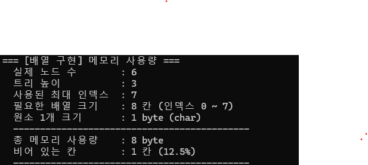
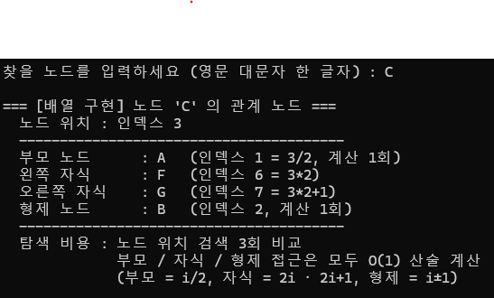

#배열과 연결자료형 구현의 비교  
##2개 구현의 메모리 사용량을 일반 이진트리, 완전이진트리, 편향 이진트리의 
각 경우에 대해 측정해서 비교하고, 
결과의 사용량 자료를 근거로 설명하세요.  

  
  
  
  
  
  

배열은 노드 수가 아니라, 높이가 메모리를 결정한다. 
높이 h인 트리는 최대 2^h-1 칸이 필요하므로, 편향 트리일수록 빈 칸이 기하급수적으로 늘어난다.  

연결 구현의 메모리는 트리의 형태와 무관하게 오직 노드 수에만 비례한다. (O(n))  
대신 노드 1개당 포인터 오버헤드가 크다.  

##2개의 구현에서 각각 특정 노드를 입력 받아서 자식, 부모, 형제 노드를 출력하는 프로그램을 작성하세요. 
이 프로그램을 분석하여 어떤 구현이 더 효율적인지 설명하세요.  

  
  

따라서 완전 이진트리처럼 노드가 규칙적으로 배치되는 경우에는 배열 구현이 효율적이고, 
노드의 삽입·삭제가 많거나 트리의 형태가 불규칙한 경우에는 연결 구현이 더 효율적이라고 볼 수 있다.  