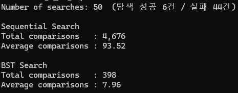
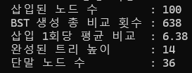
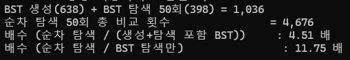

# 순차 탐색과 이진 탐색 트리 탐색의 총 및 평균 비교 횟수

# BST를 생성하는 과정에서 발생한 비교 횟수

# 두 탐색 방법의 성능 차이에 대한 분석
  
순차 탐색의 총 탐색 횟수는 4676이며 평균 탐색 횟수는 93.52이다.  
BST의 총 탐색 횟수는 398이며 평균 탐색 횟수는 7.96이다.  
순차 탐색은 찾는 값이 몇 번째에 있든 상관없이 앞에서부터 하나씩 다 봐야한다.  
과제 특성 상 탐색 대상 중 대부분이 실제 데이터에 없는 값이었는데, 
실패하는 탐색은 배열 100개를 전부 훑어야 하므로 매번 100회가 든다.  
이게 평균이 100에 가깝게 나온 이유다.  
하지만 BST는 각 노드에서 왼쪽인지 오른쪽인지 한 번의 비교로 결정한다.  
노드 100개를 담은 트리는 이상적으로 균형 잡혀 있으면 높이가 약 7.6이므로, 
성공이든 실패든 트리의 높이만큼만 비교하면 끝난다.  

# BST 생성 비용을 고려했을 때의 성능 차이에 대한 분석
BST 생성 하는데에 638회의 비교가 들었다.  
단순 비교를 했을 때 BST 생성과 BST 탐색 횟수를 더하면 1036회이고, 
순차 탐색 횟수만 보면 4676회로 약 4.51배이다.  
생성 비용은 트리를 한 번 만드는 고정 비용인데, 
이후의 탐색 50회에서 순차 탐색 대비 평균 약 85회씩 절약되기 때문이다.  
순익분기점을 계산해보면 약 7.4회가 나오는데, 
즉 탐색을 8번만 넘게 수행하면 BST를 만든 비용까지 포함한 총비용이 순차 탐색보다 싸진다.  
이번 과제는 50번 탐색했으니 손익분기점인 8회를 한참 넘어서, BST가 압도적으로 유리하다.  
하지만 탐색을 한두번만 하고 끝낼 거라면 굳이 트리를 만드는 비용을 들일 필요가 없다.  

# 이진 탐색 트리의 구조에 따라 탐색 성능이 어떻게 달라질 수 있는지에 대한 분석
같은 100개의 숫자라도 삽입되는 순서에 따라 트리의 생김새가 완전히 달라진다.  
만약 정렬된 순서로 삽입하면 BST가 일렬로 늘어진 연결 리스트가 되어버린다.  
오름차순으로 넣으면 각 값이 항상 오른쪽으로만 내려가 새 노드가 붙는다.  
그 결과 트리 높이가 100, 즉 노드 수와 같아지고 생성비용도 4950회가 되며 탐색 평균도 높아지게 된다.  
즉 BST의 성능은 데이터가 무작위 순서로 들어온다는 가정에 기대고 있다.  
데이터가 무작위로 들어온다는 가정하에 BST의 시간복잡도는 O(log n)이다.  
하지만 정렬되어 있거나 정렬에 가까운 순서로 데이터가 들어오면 
사실상 연결 리스트가 되어 순차 탐색과 다를 바 없는 성능이 되어 시간복잡도가 O(n) 수준으로 퇴화한다.  
