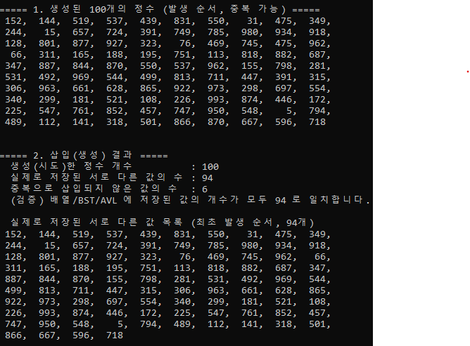
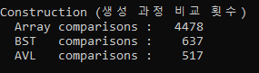
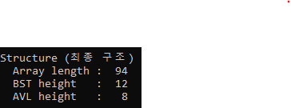
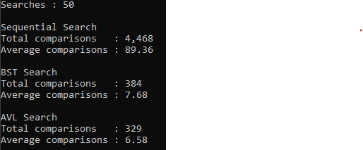

# 실제로 저장된 서로 다른 값의 수  
  

# 배열, BST, AVL 트리의 생성 과정에서 발생한 비교 횟수  
  

# 배열의 길이, BST의 높이, AVL 트리의 높이  
  

# 순차 탐색, BST 탐색, AVL 트리 탐색의 총 및 평균 비교 횟수  
  

# BST와 AVL 트리의 높이가 서로 다른 이유  
위 사진에서 BST는 높이가 12, AVL은 높이가 8이 나왔다.  
BST는 삽인 순서에 따라 트리 모양이 결정된다.  
비교적 고르게 퍼질 때도 있지만 한쪽으로 치우친 모양이 될 수도 있다.  
하지만 AVL은 노드를 하나 추가한 뒤 그 경로를 따라 올라가며 균형이 깨진 지점이 있는지 확인하고, 
깨졌으면 회전으로 즉시 바로잡는다.  
AVL 트리는 정의상 왼쪽과 오른쪽 서브트리의 높이 차이가 1이하로 유지되도록 강제하므로, 
노드 수가 n일 때 높이는 항상 (log n) 범위 안이다.  
과제 예시에서 실행을 아무리 많이 하여도 높이가 계속 8로 나오는 이유이다.  

# 트리의 높이가 탐색 비교 횟수에 미치는 영향  
BST와 AVL 탐색은 매 단계 왼쪽으로 갈지 오른쪽으로 갈지 한 번의 비교로 정하고 한 레벨씩 내려가므로, 
최악의 경우 비교 횟수가 트리의 높이와 같다.  
위 사진에서 평균 탐색 횟수를 비교해보면 BST는 7.68, AVL은 6.58이며 
성공한 탐색 뿐만 아니라 낮은 깊이에서 실패가 판정되는 경우가 있기 때문에 각 트리의 높이보다 작다.  

# 세 자료구조의 생성 비용과 탐색 비용에 대한 비교·분석  
생성 비용은 배열이 4478, BST가 637, AVL이 517이며, 탐색 비용은 배열이 4468, BST가 384, AVL이 329이다.  
생성 비용과 탐색 비용에 대한 비교 및 분석은 각 자료구조가 비슷하다.  
먼저 배열은 처음부터 하나하나 비교를 해야하기 때문에 생성 비용이 많이 들며, 
탐색도 마찬가지로  처음부터 하나하나 비교를 해야하기 때문에 많이 든다.  
BST와 AVL은 트리 구조로 왼쪽과 오른쪽 중 어느 쪽에 있을 지 한 단계씩 좁혀나가는 구조로 
비교 횟수가 배열보다 적게 든다.  
고로 생성 비용과 탐색 비용이 배열보다 훨씬 작다.  
하지만 AVL이 BST보다 적게 드는 이유는 지금 회전 연산이 비교 횟수에 들어가지 않기 때문이기도 하며 
매번 균형을 유지하는 AVL이 트리가 더 얕아 생성 중 삽입과 탐색 중에 내려가야 하는 단계 수가 적기 때문이다.  

